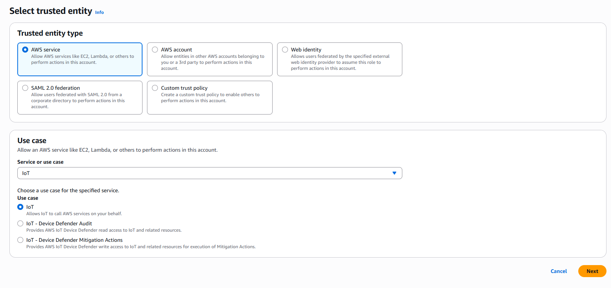

# AWS IoT Core Setup Notes

I followed this tutorial: [AWS IoT Core Beginner Tutorial](https://www.youtube.com/watch?v=idf-gGXvIu4)

## Problems I Faced

- **ARN format confusion**  
  If you have any problem with the ARN part, use it like this:  
  arn:aws:iot:<region>:<account-id>:<resource-type>/<resource-name>

- **Policy link issues**  
  Make sure to type the link properly in the policy section.  
  I struggled a lot because of small typing mistakes here.


# AWS IoT Core to CloudWatch Dashboard Setup Guide

This guide walks you through setting up a real-time dashboard for your ESP32 sensor data using AWS IoT Core and CloudWatch.

## Prerequisites

* ESP32 device connected to AWS IoT Core
* ESP32 publishing data to MQTT topic (e.g., `esp32/pub`)
* Data format example:

```json
{
  "humidity": 24,
  "temperature": 32
}
```

## Step 1: Create IAM Role for IoT Rule

### Option A: Create Role via IAM Console (Recommended)

1. **Navigate to IAM Console**
   * Go to AWS Console → Search "IAM"
   * Click on "Roles" in the left sidebar
   * Click "Create role"

2. **Select Trusted Entity**
   * Choose "AWS service"
   * Select "IoT" from the service list
   * Click "Next"

3. **Attach Permissions Policy**
   * In the search bar, type "CloudWatch"
   * Select `CloudWatchFullAccess` (for testing)
   
   
   
   * Click "Next"

   **Note:** For production environments, create a custom policy with minimal permissions:
   
   ```json
   {
     "Version": "2012-10-17",
     "Statement": [
       {
         "Effect": "Allow",
         "Action": [
           "cloudwatch:PutMetricData"
         ],
         "Resource": "*"
       }
     ]
   }
   ```

4. **Name and Create Role**
   * **Role name**: `IoTRuleCloudWatchRole`
   * **Description**: "Allows IoT Rules to publish metrics to CloudWatch"
   * Click "Create role"

## Step 2: Complete IoT Rule Setup

### Navigate to IoT Core Rules
* AWS Console → IoT Core → Message routing → Rules
* Click "Create rule"

### Configure Rule Properties
* **Rule name**: `esp32_to_cloudwatch`
* **Description**: "Forward ESP32 sensor data to CloudWatch metrics"

### Define SQL Statement
```sql
SELECT temperature, humidity FROM 'esp32/pub'
```

**Note:** Replace `'esp32/pub'` with your actual MQTT topic

### Add First CloudWatch Action (Temperature)
* Click "Add action"
* Select "Publish to CloudWatch metric"
* Configure action:
  * **Metric namespace**: `ESP32/Sensors`
  * **Metric name**: `Temperature`
  * **Metric value**: `${temperature}`
  * **Metric unit**: None (or Celsius if preferred)
  * **IAM Role**: Select `IoTRuleCloudWatchRole`
* Click "Add action"

### Add Second CloudWatch Action (Humidity)
* Click "Add action" again
* Select "Publish to CloudWatch metric"
* Configure action:
  * **Metric namespace**: `ESP32/Sensors`
  * **Metric name**: `Humidity`
  * **Metric value**: `${humidity}`
  * **Metric unit**: Percent
  * **IAM Role**: Select `IoTRuleCloudWatchRole`
* Click "Add action"

### Create Rule
* Review your configuration
* Click "Create rule"

## Step 3: Test the Rule

### Method A: Use MQTT Test Client

#### Navigate to MQTT Test Client
* IoT Core → MQTT test client
* Click "Publish to a topic"

#### Publish Test Message
* **Topic name**: `esp32/pub` (your topic)
* **Message payload**:

```json
{
  "temperature": 25.5,
  "humidity": 60
}
```

* Click "Publish"

## Step 4: Create CloudWatch Dashboard

### Create Dashboard

#### Navigate to CloudWatch Dashboards
* AWS Console → CloudWatch → Dashboards
* Click "Create dashboard"

#### Configure Dashboard
* **Dashboard name**: `ESP32-Sensor-Dashboard`
* Click "Create dashboard"

### Add Temperature & Humidity Line Chart

#### Add Line Widget
* Click "Add widget"
* Select "Line" chart type
* Click "Next"

#### Configure Metrics
* **Data source**: CloudWatch
* Click "Browse" tab
* Navigate: `ESP32/Sensors`
* Select both `Temperature` and `Humidity` metrics
* Click "Create widget"

#### Customize Widget
* **Widget title**: "Temperature & Humidity Over Time"
* **Y-axis**: You can set different axes for temperature and humidity
* **Period**: 1 minute (adjust based on your data frequency)
* **Statistic**: Average (it will be averaging what it finds at that 1 min)

### Add Current Value Number Widgets

#### Add Number Widget for Temperature
* Click "Add widget"
* Select "Number" type
* Browse → `ESP32/Sensors` → `Temperature`
* **Widget title**: "Current Temperature"
* **Statistic**: Maximum (to show latest value)
* **Period**: 5 minutes

#### Add Number Widget for Humidity
* Repeat for humidity metric
* **Widget title**: "Current Humidity"

### Configure Dashboard Settings

#### Set Auto-refresh
* Click the refresh icon in top-right corner
* Select "Auto refresh: 30s" or "1m"

#### Set Time Range
* Default: Last 1 hour
* Adjust based on your monitoring needs

#### Save Dashboard
* Click "Save dashboard"


## Quick Reference

### Key Information
* **IoT Rule Name**: `esp32_to_cloudwatch`
* **IAM Role**: `IoTRuleCloudWatchRole`
* **Metric Namespace**: `ESP32/Sensors`
* **Metrics**: `Temperature`, `Humidity`
* **MQTT Topic**: `esp32/pub`

### Expected Timeline
1. ESP32 publishes data → Immediate
2. IoT Rule processes → 1-2 minutes
3. CloudWatch receives → 2-3 minutes
4. Dashboard updates → Based on auto-refresh setting

### Troubleshooting
* **No data**: Check IoT Rule execution metrics
* **Delays**: Normal 1-3 minute delay expected
* **Permissions**: Verify IAM role has CloudWatch permissions